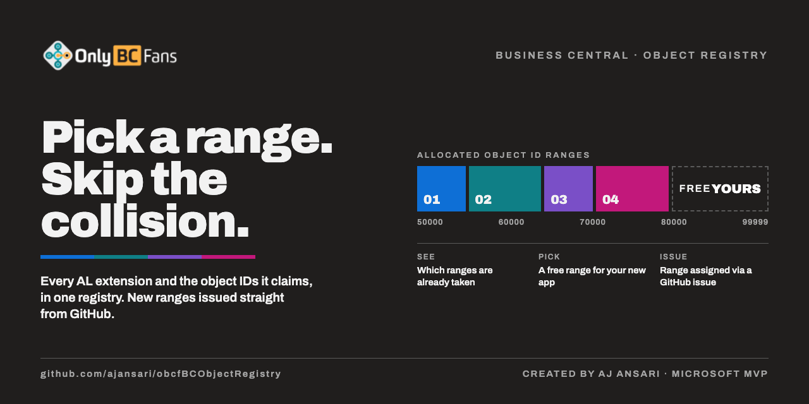
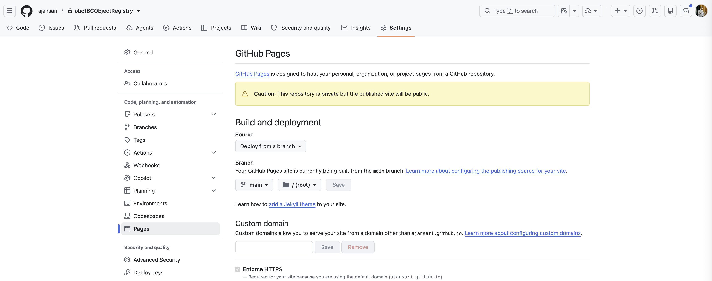

# OnlyBCFans Business Central Object Registry



A master registry of Microsoft Dynamics 365 Business Central AL extensions and the object ID ranges each one declares. Its purpose is to make it easy to see, in one place, which object ranges are already allocated across every app so that new projects can pick a free range and avoid collisions.

This tool lives in the GitHub repository. There is nothing to install. The registry, the webpage, and the Actions that add, issue, and clear rows all live in the same repo.

This repo is marked as a **Template**. To track and issue object ranges for your own apps, click **Use this template** and create your own repo. Then use your GitHub handle and your repo name in the webpage address below.

Created by **AJ Ansari** for **OnlyBCFans (OBCF)**.

Repository name: `obcfBCObjectRegistry`. Full name: [ajansari/obcfBCObjectRegistry](https://github.com/ajansari/obcfBCObjectRegistry).

## Contents

- [How to use it](#how-to-use-it)
  - [Open the webpage](#open-the-webpage)
  - [Run Actions for these tasks](#run-actions-for-these-tasks)
  - [Remove or edit an app by hand](#remove-or-edit-an-app-by-hand)
- [Does the webpage not work?](#does-the-webpage-not-work)
- [What is in this repo](#what-is-in-this-repo)
- [Workflows](#workflows)
  - [Allocate object range](#allocate-object-range)
  - [Add registry row](#add-registry-row)
  - [Clear all registry data (IRREVERSIBLE)](#clear-all-registry-data-irreversible)
  - [Update Free Range](#update-free-range)
- [How the registry is used](#how-the-registry-is-used)
- [Conventions](#conventions)
- [Related](#related)

## How to use it

### Open the webpage

The webpage is [index.html](index.html). It reads [ObjectRegistry.md](ObjectRegistry.md) every time the page loads, so it updates itself when that file changes on the default branch. You do not republish the page after an Action or a hand edit.

Open it at:

```text
https://<yourGitHubHandle>.github.io/<yourRepoName>
```

For this repo, that address is [https://ajansari.github.io/obcfBCObjectRegistry](https://ajansari.github.io/obcfBCObjectRegistry).

If that address does not load, see [Does the webpage not work?](#does-the-webpage-not-work). After Pages is on, every commit that changes `ObjectRegistry.md` shows up on the page.

To preview it on your own machine:

```sh
python3 -m http.server 8000
# then open http://localhost:8000/
```

A browser opened from disk (`file://`) cannot read the markdown file beside the page. If you open `index.html` that way, use the file picker and choose `ObjectRegistry.md`.

### Run Actions for these tasks

On GitHub, open the **Actions** tab, choose the workflow, click **Run workflow**, fill in the form, and run it on `main`. The workflow commits the result to `main`. The webpage then shows the new file.

| Task | Workflow |
|---|---|
| Add one project that already has a name, App ID, and object range | **Add registry row** |
| Get a new object range issued, and add that project to the registry | **Allocate object range** |
| Clear the Object Registry table | **Clear all registry data (IRREVERSIBLE)** |
| Fix the Free ranges table after a hand edit | **Update Free Range** |

**Add registry row** also updates the Free ranges table. The range you enter is no longer listed as available. That can shorten one free-range row, split one row into two, or remove a row. **Allocate object range** does the same when it writes the issued range.

### Remove or edit an app by hand

The easiest way to remove an app, or to edit a row, is to edit [ObjectRegistry.md](ObjectRegistry.md). You can do that in any of these places:

- GitHub, with the pencil on the file, committing to `main`
- GitHub Codespaces
- Visual Studio Code

The webpage reads that file, so the list updates when the commit reaches `main`.

If you remove an app, also update the Free ranges table so the object IDs it held are listed as available again. If you change a range, update Free ranges the same way. If you skip that, run **Update Free Range**. It reads every range still in the Registry table and recreates the Free ranges rows. It does not add or remove apps.

A hand edit of `ObjectRegistry.md` does not change `registry.json`. If you remove or change an app in the markdown, make the same change in `registry.json`, or the next **Allocate object range** run can write the old row back.

## Does the webpage not work?

The webpage is optional. Its benefit is that you can sort, filter, and search the registry. The markdown file on GitHub cannot do that.

GitHub Pages sites are public, even when the repository is private. If you do not want a public webpage, skip the steps below. The registry file and the Actions still work without it.

To turn the page on:

1. Open **Settings**.
2. Open **Pages**. It is under **Code, planning, and automation**.
3. Under **Build and deployment**, choose **Deploy from a branch**.
4. In the branch box, select **main**.
5. In the next box, select **/ (root)**.
6. Click **Save**.



The page can take a minute to appear. Then open `https://<yourGitHubHandle>.github.io/<yourRepoName>`.

To turn the page off after you have already saved those settings, go back to **Build and deployment**. Change the branch from **main** (or whatever it is now) to **None**, then click **Save**.

## What is in this repo

| File | Purpose |
|---|---|
| [README.md](README.md) | This guide. |
| [LICENSE](LICENSE) | PolyForm Shield License 1.0.0. Copyright AnsariCo, Inc. dba OnlyBCFans. Source-available, not open source. |
| [LICENSE-ADDITIONAL-TERMS.md](LICENSE-ADDITIONAL-TERMS.md) | Additional Terms that narrow the PolyForm Shield License (commercial embedding, sale of the Registry, names and marks). |
| [COMMERCIAL.md](COMMERCIAL.md) | Plain-language summary of what is free and what needs a commercial agreement, and how to ask for one. |
| [ObjectRegistry.md](ObjectRegistry.md) | The registry people read and edit. Registry table, notes, and Free ranges table. |
| [index.html](index.html) | The webpage. It has no data of its own. Click column headers to sort; filter by text, type, visibility, overlap status, or hide retired repos. |
| [registry.json](registry.json) | The copy the Actions and `build.py` keep beside the markdown. `githubOwner` is the account path used when an entry has no URL of its own. |
| [build.py](build.py) | Renders `ObjectRegistry.md` from `registry.json`. Needs only Python 3, no packages. |
| [.github/workflows/allocate-object-range.yml](.github/workflows/allocate-object-range.yml) | Issues the next free object range and adds the project. |
| [.github/workflows/add-registry-row.yml](.github/workflows/add-registry-row.yml) | Adds one project by hand and updates Free ranges. |
| [.github/workflows/clear-all-registry-data.yml](.github/workflows/clear-all-registry-data.yml) | Clears the Registry table. Irreversible. |
| [.github/workflows/update-free-range.yml](.github/workflows/update-free-range.yml) | Rebuilds the Free ranges table from the Registry table. |
| [.github/scripts/](.github/scripts) | Python scripts those workflows run. |

## Workflows

These workflows are run by hand from the repository **Actions** tab of [ajansari/obcfBCObjectRegistry](https://github.com/ajansari/obcfBCObjectRegistry). Open **Actions**, choose the workflow in the left sidebar, click **Run workflow**, fill in the form, and run it on `main`. Each workflow commits its change to `main`.

### Allocate object range

Use **Allocate object range** when you know how many object IDs the next app needs but do not have a repo yet.

1. Choose **Allocate object range** and run it from `main`.
2. Enter the range size (for example `10`, `20`, or `50`) and a placeholder project name.
3. The workflow reads `ObjectRegistry.md` on `main`, takes the first contiguous free block of that size between **50000** and **99999**, and writes the assigned range (for example `50000-50009`) to the job summary.
4. It appends a registry row named `{project} - Pending` with that range and the UTC issue date, removes that range from the Free ranges table, and commits the change to `main`.

### Add registry row

Use **Add registry row** to add one project that already has a name, an App ID, and an object range. The new row is added at the end of the Registry table.

The workflow then rebuilds the Free ranges table from every range in the Registry table, including the new one. The newly added range is no longer shown as available. A free-range row that contained those IDs is shortened, split into the gaps on either side, or removed if the new range used the whole row. A range outside 50000–99999, such as an AppSource range, does not change the Free ranges table.

The form collects:

| Field | Required | Written to |
|---|---|---|
| App name | Yes | App name |
| App ID | Yes | App ID |
| Object range(s), for example `50000-50010` | Yes | Object range(s) |
| Type (`PTE` or `AppSource`) | Yes | Type |
| GitHub or DevOps repo name | No | Repo name |
| Repo URL | No | Hyperlink on the repo name, with `target="_blank"` |
| Repo visibility (`Public` or `Private`) | No | Visibility |

Leave the last three fields blank when they are not available. If a repo URL is provided without a repo name, the last segment of the URL is used as the link text. The workflow also records the app in `registry.json` so a later render does not drop the row. **Overlaps with** is filled in for the new row, and any existing row that intersects the new range is updated.

### Clear all registry data (IRREVERSIBLE)

**Run this only when all registry data must be deleted. The wipe cannot be reversed from the current files.**

**Clear all registry data (IRREVERSIBLE)** removes every data row in the Registry table, leaving the header row and the dash separator. It then replaces the Free ranges table with one row, `50000–99999`, because that whole range is available again. It also:

- clears every app in `registry.json`, so the deleted rows are not written back by the next render
- replaces the notes in both files with one line stating that the registry was cleared

GitHub shows a confirmation form **before** the workflow runs. The choice defaults to **No, do not clear**. To proceed:

1. Open **Actions**, choose **Clear all registry data (IRREVERSIBLE)**, and click **Run workflow**.
2. Read the warning on the form.
3. Change the confirmation choice from `No, do not clear` to `Yes, clear all data`.
4. Type `CLEAR ALL DATA` in the confirmation phrase field.
5. Click the green **Run workflow** button.

If either answer is wrong, the workflow stops and does not change any files. A previous git commit is the only copy of the deleted rows.

### Update Free Range

Use **Update Free Range** after a hand edit of [ObjectRegistry.md](ObjectRegistry.md), when the Free ranges table may no longer match the Registry table.

It reads every object range still listed in the Registry table and recreates the Free ranges rows for 50000–99999. It does not add, remove, or edit apps. If the free list is already correct, it commits nothing.

Run it from **Actions** with no form fields. Click **Run workflow** on `main`.

## How the registry is used

1. **To see the registry**, open the webpage at `https://<yourGitHubHandle>.github.io/<yourRepoName>`.
2. **To add one project that already has a range**, run **Add registry row**.
3. **To get a new object range issued and added**, run **Allocate object range**.
4. **To remove or edit an app**, edit `ObjectRegistry.md` in GitHub, GitHub Codespaces, or Visual Studio Code. If you remove an app, also update the Free ranges table, or run **Update Free Range**.
5. **When a repo is archived or renamed**, keep the row and prefix the repo name with `OLD-DNU-` so the range stays visible as historically allocated.
6. **When the whole register must be wiped**, run **Clear all registry data (IRREVERSIBLE)**. Do not use it for one app. After it runs, Free ranges is the single row `50000–99999`.

## Conventions

- Object ranges are taken from each app's `app.json` `idRanges` and are recorded as inclusive `from–to` pairs. Multiple ranges for one app are separated by semicolons.
- The **Type** column records `PTE` for Per-Tenant Extensions (object IDs 50000–99999) and `AppSource` for apps in the AppSource range (70000000+).
- The **Visibility** column reflects the GitHub repository metadata on the date shown at the top of the registry.
- A range in the registry is a manifest allocation. It does not prove every ID in the range is in use, or that the app is installed in any Business Central tenant.
- Overlaps and shared placeholder App IDs are called out in the registry's Notes section rather than silently resolved.

## Related

- [ajansari/obcfBCObjectRegistry](https://github.com/ajansari/obcfBCObjectRegistry)
- [AJ Ansari - OnlyBCFans](https://github.com/ajansari) on GitHub
- OBCF AL Development Standards Guide (object ID allocation rules)

## Contact Information

- [AJ Ansari - LinkedIn](https://linkedin.com/in/ajansari)
- [AJAnsari.com](https://ajansari.com)

## License

Licensor Line of Business: Business Central object ID range registry and allocation (OnlyBCFans Business Central Object Registry, https://github.com/ajansari/obcfBCObjectRegistry)
